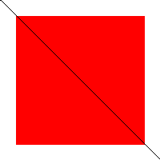
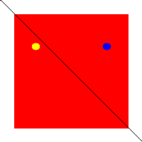
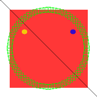
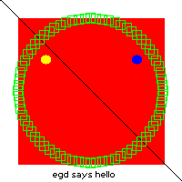

# Erlang Graphical Drawer

Erlang Graphical Drawer ([egd](https://github.com/erlang/egd)) is an interface
for 2d-image rendering and is used by
[Percept](https://github.com/erlang/percept) to generate dynamic graphs to
its web pages. All code is pure Erlang, no drivers needed.

The library is intended for small to medium image sizes with low complexity for
optimal performance. The library handles horizontal lines better then vertical
lines.

The foremost purpose for this module is to enable users to generate images from
Erlang code and/or datasets and to send these images to either files or web
servers.

## File example

Drawing examples:

```erlang
-module(img).

-export([do/0]).

do() ->
    Im = egd:create(200,200),
    Red = egd:color({255,0,0}),
    Green = egd:color({0,255,0}),
    Blue = egd:color({0,0,255}),
    Black = egd:color({0,0,0}),
    Yellow = egd:color({255,255,0}),

    % Line and fillRectangle

    egd:filledRectangle(Im, {20,20}, {180,180}, Red),
    egd:line(Im, {0,0}, {200,200}, Black),

    egd:save(egd:render(Im, png), "test1.png"),

    egd:filledEllipse(Im, {45, 60}, {55, 70}, Yellow),
    egd:filledEllipse(Im, {145, 60}, {155, 70}, Blue),

    egd:save(egd:render(Im, png), "test2.png"),

    R = 80,
    X0 = 99,
    Y0 = 99,

    Pts = [ {X0 + trunc(R*math:cos(A*math:pi()*2/360)),
             Y0 + trunc(R*math:sin(A*math:pi()*2/360))
            } || A <- lists:seq(0,359,5)],
    lists:map(
        fun({X,Y}) ->
            egd:rectangle(Im, {X-5, Y-5}, {X+5,Y+5}, Green)
        end, Pts), 

    egd:save(egd:render(Im, png), "test3.png"),

    % Text
    Filename = filename:join([code:priv_dir(egd), "fonts", "6x11_latin1.wingsfont"]),
    Font = egd_font:load(Filename),
    {W,H} = egd_font:size(Font),
    String = "egd says hello",
    Length = length(String),

    egd:text(Im, {round(100 - W*Length/2), 200 - H - 5}, Font, String, Black),

    egd:save(egd:render(Im, png), "test4.png"),

    egd:destroy(Im).
```

First save:



Second save:



Third save:



Fourth save:



## ESI example

Using `egd` with [inets](https://www.erlang.org/doc/apps/inets/) ESI to generate
images on the fly:

```erlang
-module(img_esi).

-export([image/3]).

image(SessionID, _Env, _Input) ->
    mod_esi:deliver(SessionID, header()),
    Binary = my_image(),
    mod_esi:deliver(SessionID, binary_to_list(Binary)).

my_image() ->
    Im = egd:create(300,20),
    Black = egd:color({0,0,0}),
    Red = egd:color({255,0,0}),
    egd:filledRectangle(Im, {30,14}, {270,19}, Red),
    egd:rectangle(Im, {30,14}, {270,19}, Black),

    Filename = filename:join([code:priv_dir(egd), "fonts", "6x11_latin1.wingsfont"]),
    Font = egd_font:load(Filename),
    egd:text(Im, {30, 0}, Font, "egd with esi callback", Black),
    Bin = egd:render(Im, png),
    egd:destroy(Im),
    Bin.

header() ->
    "Content-Type: image/png\r\n\r\n".
```

Result:


For more information regarding ESI, please see
[inets](https://www.erlang.org/doc/apps/inets/) application
[mod_esi](https://www.erlang.org/doc/apps/inets/mod_esi.html#).
